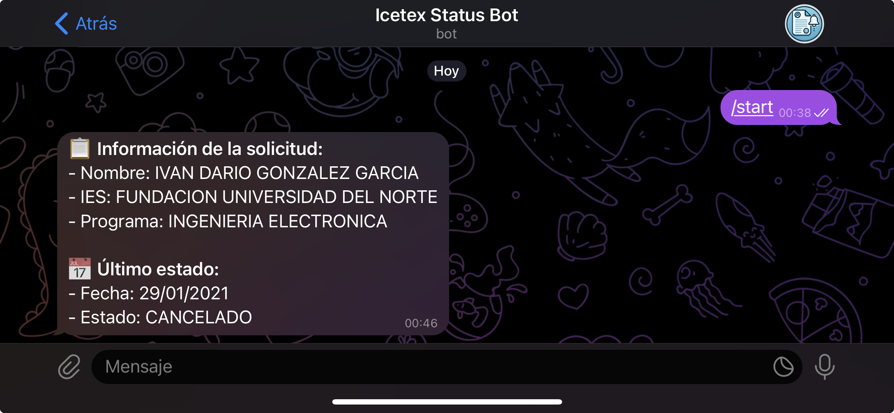

# ICETEX Status Monitor Bot

Este proyecto está diseñado para monitorear el estado de las solicitudes de ICETEX y envía notificaciones a **Telegram** cuando hay cambios en el estado de una solicitud específica.

El bot se ejecuta dentro de un contenedor Docker y es compatible tanto con sistemas **AMD** como **ARM** (Raspberry Pi). Utiliza **Puppeteer** para el scraping y **Telegram Bot API** para las notificaciones.

## Imágenes


**Chat**

## Características

- **Monitoreo de Servicios**: Monitorea continuamente el estado del servicio de ICETEX.
- **Notificaciones por Telegram**: Envía actualizaciones en tiempo real sobre el estado del servicio a través de Telegram.
- **Dockerizado**: Despliega el servicio fácilmente utilizando Docker y Docker Compose.
- **TypeScript**: El proyecto está escrito en TypeScript, lo que garantiza seguridad de tipos y características modernas de JavaScript.

## Prerrequisitos

Antes de comenzar, asegúrate de tener instalado lo siguiente:

- [Node.js](https://nodejs.org/) (v14+)
- [Docker](https://www.docker.com/)
- [Docker Compose](https://docs.docker.com/compose/)
- Token de Bot de Telegram

### Variables de Entorno

Debes definir las siguientes variables de entorno. Debes crear un archivo `.env` basado en el archivo de ejemplo `.env.example`:

```
TELEGRAM_TOKEN=your-telegram-bot-token
```

## Configuración del Proyecto

### Clonar el repositorio

Clona el proyecto desde el repositorio de Git:

```bash
git clone https://github.com/ivangonzalezg/icetex-status-monitor.git
cd icetex-status-monitor
```

### Archivo `.env`

Crea un archivo `.env` en la raíz del proyecto basado en el archivo `.env.example`:

```bash
cp .env.example .env
```

Rellena las variables en el archivo `.env` con tus propios valores (como tu token de Telegram, etc.).

### Añadir credenciales de Firebase

Asegúrate de tener el archivo service-account.json de Firebase, el cual contiene las credenciales necesarias para conectarse a Firestore. Colócalo en el directorio raíz del proyecto.

### Construcción y Ejecución con Docker

1. **Construir la imagen Docker:**

   ```bash
   docker-compose build
   ```

2. **Ejecutar el contenedor:**

   ```bash
   docker-compose up -d
   ```

   Esto levantará el servicio y el bot comenzará a verificar el estado de la solicitud en intervalos definidos en el código.

### Logs

Puedes verificar los logs para ver la salida del bot y asegurarte de que está funcionando correctamente:

```bash
docker logs -f icetex-status-monitor
```

### Detener el Bot

Si deseas detener el bot, puedes hacerlo con el siguiente comando:

```bash
docker-compose down
```

# Ejecutar con Docker Compose

Si no quieres construir la imagen localmente, puedes utilizar la imagen ya construida:

1. Crea un archivo `docker-compose.yml` con el siguiente contenido:

   ```yaml
   services:
     icetex-status-monitor:
       container_name: icetex-status-monitor
       image: ivangonzalezg/icetex-status-monitor:latest
       env_file:
         - .env
       volumes:
         - ./service-account.json:/usr/src/app/service-account.json:ro
   ```

2. Ejecuta el siguiente comando para iniciar el contenedor:

   ```bash
   docker-compose up -d
   ```

## Estructura del Proyecto

```
icetex-status-monitor/
├── Dockerfile
├── docker-compose.yml
├── .env.example
├── package.json
├── tsconfig.json
├── src/
│   ├── constants/
│   ├── database/
│   ├── services/
│       ├── icetex/
│       └── telegram/
└── index.ts
```

## Problemas Comunes

### Error de Puppeteer: "Could not find expected browser"

Si encuentras un error relacionado con que Puppeteer no puede encontrar un navegador, asegúrate de que has instalado todas las dependencias necesarias para Chromium o que has configurado Puppeteer para usar el navegador del sistema.

## Contribuir

Si deseas contribuir a este proyecto, siéntete libre de abrir issues o pull requests en el repositorio.

1. Haz un fork del repositorio.
2. Crea una nueva rama (`git checkout -b nombre-de-la-funcionalidad`).
3. Realiza tus cambios y haz commit (`git commit -am 'Añadir nueva funcionalidad'`).
4. Haz push a la rama (`git push origin nombre-de-la-funcionalidad`).
5. Crea un nuevo Pull Request.

## Licencia

Este proyecto está licenciado bajo la [MIT License](https://opensource.org/licenses/MIT).
